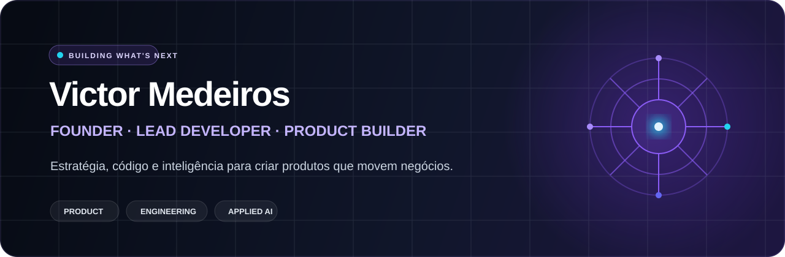

<div align="center">
  
</div>

<br />

<div align="center">

### Eu transformo problemas complexos em produtos simples, úteis e escaláveis.

**Founder @ Hub ConverseIA · Lead Developer · Product Builder**

[](https://www.linkedin.com/in/victor-medeiros-24a414176/)
[](https://github.com/victormdeiros)

</div>

---

## Construo na interseção entre negócio e tecnologia

Sou **sócio fundador da Hub ConverseIA**. Atuo da descoberta do problema à entrega do produto, conectando estratégia, arquitetura, experiência e execução.

Mais do que desenvolver software, gosto de criar sistemas que eliminam atrito, organizam operações e ajudam pessoas e empresas a tomar decisões melhores.

<table>
  <tr>
    <td width="33%" valign="top">
      <h3>01 · Produto</h3>
      Transformo contexto de negócio em uma visão clara, prioridades executáveis e experiências que fazem sentido para quem usa.
    </td>
    <td width="33%" valign="top">
      <h3>02 · Engenharia</h3>
      Projeto e desenvolvo aplicações web, plataformas SaaS, integrações e arquiteturas preparadas para evoluir.
    </td>
    <td width="33%" valign="top">
      <h3>03 · Inteligência</h3>
      Aplico IA, automação e dados onde eles geram eficiência real — dentro do fluxo de trabalho, não apenas na apresentação.
    </td>
  </tr>
</table>

## Da ideia à operação

```text
PROBLEMA  →  ESTRATÉGIA  →  ARQUITETURA  →  PRODUTO  →  AUTOMAÇÃO  →  ESCALA
```

- Liderança técnica com visão de produto e negócio
- Desenvolvimento de plataformas e produtos SaaS
- Inteligência artificial aplicada a operações reais
- Automação de processos e integração de sistemas
- Dados transformados em contexto para decisão

## Ferramentas que fazem parte do meu trabalho

<div align="left">


</div>

## Princípios que guiam meu trabalho

> **Clareza antes da complexidade. Produto antes da vaidade. Impacto antes da tecnologia.**

Eu acredito em construir perto do problema, validar cedo, medir o que importa e evoluir continuamente. Código é parte da solução; entendimento, direção e execução completam o trabalho.

---

<div align="center">

### Tem um problema relevante para resolver?

[**Vamos conversar no LinkedIn →**](https://www.linkedin.com/in/victor-medeiros-24a414176/)

<sub>Recife, Pernambuco · Construindo produtos digitais a partir do Brasil</sub>

</div>
